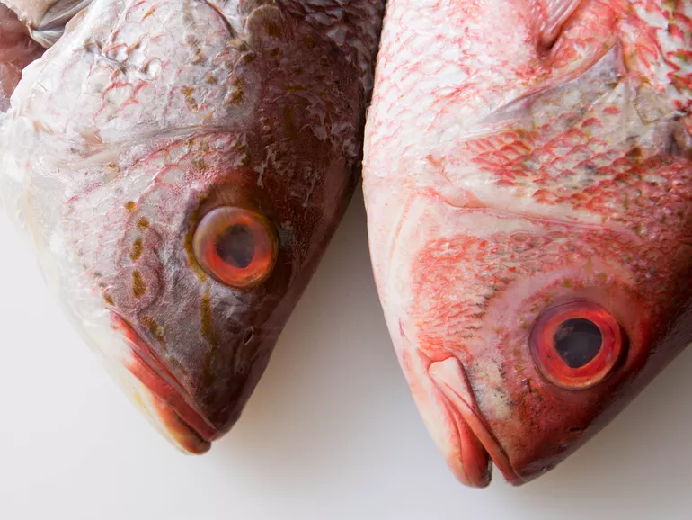

# Preparing Sashimi at Home: Comprehensive Guide

## Sourcing Fish

### Note on Grading Labels

In Japan, sashimi-grade refers to fish caught by hand and killed in a process known as [ikejime](https://www.cookingissues.com/index.html%3Fp=5661.html): a quick spike driven into the brain, which kills the fish instantly without releasing any lactic acid into the flesh, allowing it to stay fresher for longer. 

There is no national governing body that grades fish in the same way that the US Department of Agriculture (USDA) grades beef. when you see a piece of fish labeled sushi- or sashimi-grade, that means that the seller has judged it safe to eat raw. The claim is only as trustworthy as the fish market that makes it.

Fish with a “sushi-grade” or “sashimi-grade” label are not necessarily high quality, as individual retailers can use these labels as they see fit. (There isn’t a government-regulated grading system for fish in the United States.) 

### Safety

#### Parasites

Tuna has no risk of parasites and is most recommended. Large marine fish are the safest. Freshwater and anadromous fish are much higher risk, especially cod, which also has too much moisture to be good raw - wild salmon should be sourced carefully.

##### Super Freezing
Any wild fish except tuna species—bigeye, yellowfin, bluefin, bonito/skipjack—need to be frozen for specific periods of time at specific temperatures to get rid of parasites according to FDA Guidelines (which are not enforced as law in all states). This requires freezing below -31°F that are not possible with home freezers.

Despite the FDA's blanket recommendations for the elimination of parasites, which is the main goal of its freezing guidelines, very few infections from eating raw fish have been documented in American medical literature. In the US, eating raw fish that hasn't been frozen is rare enough that the agency's "Bad Bug Book" uses Japan as a reference point, since the practice is far more prevalent there. But even in Japan, where freezing of fish meant for sashimi is not required, reported infection rates are vanishingly small compared to the total population. (For instance, the Bad Bug Book reports "more than 1,000 cases" of infection by anisakis worms, the most common parasite in marine fish, reported annually in Japan, but keep in mind that's out of a total population of ~127 million in 2015.)

#### Bacteria
parasites in raw fish are less of a concern than bacterial contamination. fish could be kept at unsafe temperatures for a long enough period of time to encourage the growth of pathogenic bacteria. Generally speaking, fish must be kept below 40°F (4°C) to inhibit that growth. 

cooks who want to prepare raw fish at home should take similar precautions: sanitizing their work areas and tools, working with clean hands, touching the fish flesh as little as possible while they prepare it, and doing all they can to keep the fish as cold as possible.

### Sourcing Quality Fish

What it means for a specific fish to be sashimi-grade depends not just on the safety of the fish, but also on its quality. Always source wild fish, ideally local. 

Ideally the fish would not remain whole overnight. It should be scaled, gutted, de-headed, washed in running water, fileted and frozen in a super freezer.

#### Signs of Quality Fish

 It's easier to gauge freshness with a whole fish than with a fillet -- you can order fish whole and ask it to be gutted, scaled, cleaned and filleted at home, or optionally have them fillet it (though its fresher to filet directly before serving). If the fishmonger fillets your fish, ask it to be dry filetted and wrapped.

Signs of fresh whole fish:

* Bright red gills (not brown, or cut out)
* Bulbous and clear eyes (not cloudy)
* Firm, slightly rubber flesh (neither hard and dry, or squishy and soft)
* Slimy coat (sometimes, but not always present)

Eg: A poor quality fish, at left, has cloudy eyes and sunken looking flesh. A better fish, at right, has clear eyes and plump flesh.

If buying filleted fish, try to ask for fillets specifically designated for raw use.

Signs of fresh fillets:
* Look shiny and wet
* Firm flesh (not flaking)
* Opaque with a deep color (no dark red or brownish spots)

You can eliminate risk of parasites in a less trustworthy fish market by asking if the fish market has a super freezer and for them to flash freeze the fish for you before the sale; if they won't, you're better off sticking to tuna.

#### Signs of a Quality Fishmonger
Fish fillets are placed on aluminum trays, set in an overabundance of crushed ice, with sufficient drainage, and oriented so that their flesh touches other fish flesh as little as possible. Whole fish is buried in ice, with each fish set in a posture similar to the way it swims through the water. (This is done to account for the way the innards settle due to gravity; keeping an upright-swimming fish upright ensures that one side doesn't end up squished, which would detract from the quality of the flesh.) The fish cutting boards behind the counter, where the staff cut whole fish into fillets in full view of customers, are hosed down and sanitized regularly. displays of fish never smell off or fishy; instead, the air has a clean, marine smell.

#### What to Ask a Fishmonger

* Which fish are local and in season
* What's fresh and recommended
* To de-scale, pinbone, de-gut and de-head the fish
* For a bag of ice to keep the wrapped fish in

### Types of Fish for Sashimi

Buy Whole, Fresh Marine Fish (but Not Cod - Avoid anything from the cod family, which has a watery flesh that is not ideal for raw preparations. avoid freshwater fish due to tapeworms.

### Storing Fish

Fish should be eaten in 1 or 2 days, or frozen for up to 4 months.

Steps to defrost frozen fish for sashimi:
1. Wash frozen fish with tap water
2. Prepare a bath of lukewarm (35-40C) water saturated with salt. It should be as salty as the sea. To confirm it is salty enough, the frozen fish should float, not sink.
3. Let the fish sit for 3-4 minutes. (it will not be thawed at this point.
4. Remove from the salt water, rinse and pat dry with paper towels.
5. Wrap the fish in paper towels and place in a plastic bag. Put in the refrigerator (5C) to thaw for about 5 hrs.

Wrap any uneaten sashimi in plastic and refrigerate it. Sushi places do this; fish won't go bad overnight. But we either eat it all the next day, or freeze or cook it two days later.

### Buying Fresh Fish

Buy the freshest marine fish you can find from a trusted fishmonger or market. Some specialty shops sell sashimi-ready fillets, but you can buy a whole fish in more conventional markets, then clean and fillet it yourself, depending on your comfort level. If you’re buying a whole fish, look for clear, not cloudy, eyes and bright-red gills.  When in doubt, ask the fishmonger for a recommendation.

### Preparation

Sanitize surface
Hira-Zukuri Cut: flat-slice,” is the most common: a ⅜ inch slice about the length of a domino

### Knife

Sashimi knives are indispensable. Japanese sashimi knives, yanagi ba, have a beveled right side and a flat left side whereas Western-style sashimi knives, sujihiki, have a double-beveled edge. The single-beveled edge of a yanagi ba has unmatched precision and slices through delicate seafood with little effort. If you’re left-handed, you’ll need to specify a left-handed yanagi ba with the bevel on the left side. Western-style sashimi knives come with the left- and right-side bevels ground at different angles, usually 70:30, 60:40 and 90:10.

Sashimi knives range from around $15 to $7,500 or more. You can get a high-quality knife for well under $100. However, before you purchase one, consider how often you’ll use it. If you make sashimi only a couple times a month, buy an inexpensive knife, somewhere between $25 and $50 . High-end knives hold an edge longer, but cheap knives sharpen easier.

$199
Masahiro Stainless Yanagiba 240mm

### Sanitize Work Area

At home, make sure your work area and tools are as clean as possible, and that the counter and cutting board (preferably a reversible one) have been sanitized properly, on both sides, using a bleach solution. (To sanitize a cleaned and rinsed cutting board or kitchen counter, spray on a solution made with one tablespoon of bleach per gallon of water. Let the surfaces air-dry, or allow the solution to sit for at least 30 seconds before wiping the board dry.)

Dry both the fish and the cutting board very thoroughly, using clean kitchen towels or paper towels, and, of course, make sure your hands are clean before you begin skinning and cutting.

### Cutting the sashimi

Slice with a pulling motion (draw-stroke) instead of a sawing motion. With a sharp knife, you only need to make one pass.
Use the hira-zukuri cut (2″-long, 3/8″-thick rectangular slices) for salmon, tuna and kingfish.
Use the uzu-zukuri cut (2″-long, 1/8″-thick rectangular slices) for shellfish and white fish, such as bream, mackerel and flounder

https://www.seriouseats.com/how-to-prepare-raw-fish-at-home-sushi-sashimi-food-safety
https://www.seriouseats.com/best-way-to-store-fish-refrigerator-ice-packs